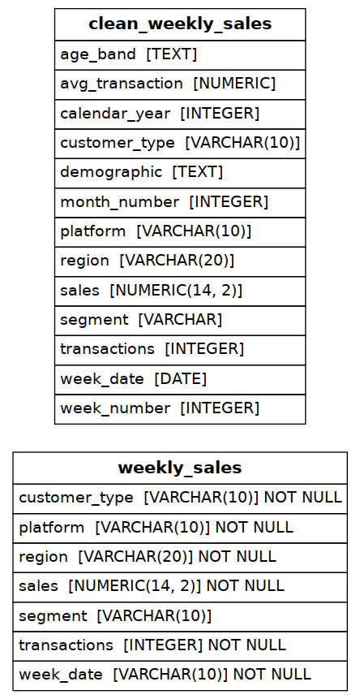

# Data Mart — Data Cleaning & Before/After Impact Analysis

A PostgreSQL project built around Danny Ma's [Data Mart case study](https://8weeksqlchallenge.com/case-study-5/)
(8 Week SQL Challenge). Data Mart is a fictional online supermarket; in June 2020 it switched to
fully sustainable packaging "in partnership with Eco Mums and Green Daddy" — and the business
wants to know whether that change actually hurt sales, and if so, where it hurt most.

## 1. Why a Synthetic Dataset?

Like the other case studies in this series, only 10 example rows are published on the public case
study page — the full dataset lives inside Danny's paid course. A before/after impact analysis is
**meaningless on 10 rows**, so this project generates a 51,000+ row synthetic `weekly_sales` table
(`scripts/generate_data.py`) spanning 2018–2020, across 7 regions, 2 platforms, 7 customer
segments, and 3 customer types — with a **deliberate, non-uniform sales dip** built in starting
the week of 2020-06-15, so the analysis has a genuine signal to detect rather than just noise.

The dip is intentionally uneven: it hits Retail harder than Shopify, older customer segments
harder than younger ones, and OCEANIA hardest of any region — mirroring the real-world basis for
this case study (a sustainable-packaging change is far more disruptive in person, at a physical
shelf, than at an online checkout). This makes Section 4's "which areas were hit hardest"
bonus question answerable with a real, defensible result instead of an arbitrary one.

## 2. Schema



The raw table is a single, fairly wide table — `weekly_sales` — matching the case study's column
dictionary exactly. `week_date` is stored as `VARCHAR`, **not** `DATE`, on purpose: the case
study's own example rows use a `D/M/YY` string format (`"9/9/20"`), and parsing that into a real
date is the first required cleaning step, not something to assume away in the schema.

`clean_weekly_sales` (built in `03_clean_data.sql`) is the derived, analysis-ready table:

| Added column | Logic |
|---|---|
| `week_date` | Parsed from the raw `D/M/YY` string into a real `DATE` |
| `week_number` | **Not** Postgres's built-in ISO week — the case study defines its own rule (day 1–7 of the year = week 1, day 8–14 = week 2, etc.), which is `CEIL(day_of_year / 7)` |
| `month_number`, `calendar_year` | Extracted from the parsed date |
| `age_band` | From the trailing digit of `segment`: 1 → Young Adults, 2 → Middle Aged, 3/4 → Retirees |
| `demographic` | From the leading letter of `segment`: C → Couples, F → Families |
| *(segment, age_band, demographic)* | `NULL` segment rows are relabelled `'unknown'` rather than dropped |
| `avg_transaction` | `sales / transactions`, rounded to 2dp |

## 3. Data Exploration (`04_data_exploration.sql`)

Nine exploration questions, the most conceptually important being **Q9**: can the `avg_transaction`
column just be averaged directly to get average transaction size? **No** — `AVG(avg_transaction)`
weights every row equally regardless of how many actual transactions it represents, which is a
real and common analytics mistake. The correct method is a transactions-weighted average:
`SUM(sales) / SUM(transactions)`. Both are computed side-by-side in the query so the difference
(small here, but conceptually always present) is directly visible.

This section also surfaces a genuine data-quality finding: **week numbers 1 and 53 are missing
from every year** in the dataset (the partial first/last weeks of each calendar year), discovered
with a `generate_series` / `EXCEPT` query rather than assumed.

## 4. Before & After Analysis (`05_before_after_analysis.sql`)

The core deliverable. Compares total sales in the 4 weeks and 12 weeks immediately before vs.
after the 2020-06-15 packaging change:

| Window | Before | After | Change |
|---|---|---|---|
| 4 weeks | $15.43M | $13.18M | **−14.6%** |
| 12 weeks | $46.41M | $41.19M | **−11.2%** |

To rule out this just being normal seasonality, the same 12-week calendar window is compared
across all three years:

| Year | Before → After change |
|---|---|
| 2018 | +0.6% (normal seasonal growth) |
| 2019 | +0.2% (normal seasonal growth) |
| 2020 | **−11.2%** (the packaging change) |

2018 and 2019 both show small, ordinary growth across this exact window; only 2020 shows a
decline — solid evidence the drop is tied to the packaging change specifically, not seasonality.

## 5. Bonus Question — Which Areas Were Hit Hardest?

Breaking the 12-week before/after comparison down by dimension:

| Dimension | Hit hardest | Hit least |
|---|---|---|
| Region | **OCEANIA** (−15.8%) | USA (−3.8%) |
| Platform | **Retail** (−12.7%) | Shopify (−5.8%) |
| Age band | **Retirees** (−13.3%) | Young Adults (−8.1%) |
| Customer type | **New customers** (−14.9%) | Existing customers (−8.4%) |

The pattern is consistent with intuition: a physical packaging change is more disruptive in-store
than online, more disruptive to older/habit-driven shoppers than younger ones, and more disruptive
to customers who haven't yet built loyalty than to existing, established ones.

## 6. How to Run

```bash
createdb data_mart_db
psql -d data_mart_db -f sql/01_schema.sql
psql -d data_mart_db -f sql/02_seed_data.sql
psql -d data_mart_db -f sql/03_clean_data.sql
psql -d data_mart_db -f sql/04_data_exploration.sql
psql -d data_mart_db -f sql/05_before_after_analysis.sql
```

## 7. What This Project Demonstrates

- String-to-date parsing and a **custom week-numbering rule** that deliberately differs from a
  database's built-in date functions — recognizing when a business definition doesn't match the
  "obvious" technical one
- Identifying and naming a real, common analytics mistake (averaging an already-averaged column)
  rather than just computing a number
- A genuine **before/after / event-impact analysis** pattern: comparing a metric across a fixed
  window before and after a known event, then validating the finding against the same window in
  prior years to rule out seasonality — a technique that generalizes directly to measuring the
  impact of a price change, a feature launch, or a marketing campaign
- Breaking down an aggregate effect by multiple dimensions to find where impact concentrates,
  rather than stopping at a single top-line number

---

*This project implements Danny Ma's Data Mart case study from the
[8 Week SQL Challenge](https://8weeksqlchallenge.com/case-study-5/). The synthetic dataset,
cleaning logic, and analysis are original work built to the case study's exact rules and column
definitions.*
