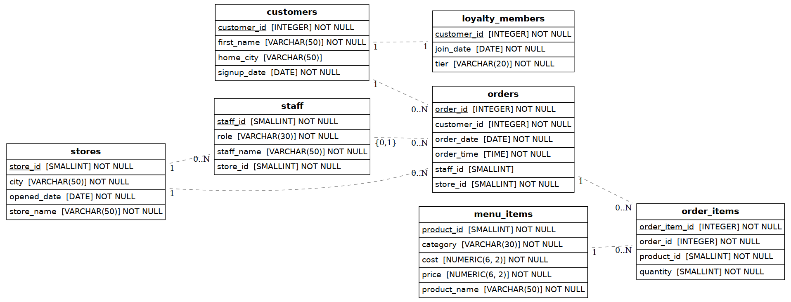

# FlavorMetrics — Restaurant Chain Customer & Loyalty Analytics

A PostgreSQL analytics project that simulates a multi-location restaurant chain and answers the
question every growing F&B business eventually asks: **is our loyalty program actually working,
and which customers should we be investing in?**

Built as an end-to-end exercise covering schema design, realistic synthetic data generation,
and analytical SQL — from basic aggregation through window functions, CTEs, and
RFM-style customer segmentation.

---

## 1. Business Context

FlavorMetrics is a fictional 3-location Japanese-fusion restaurant chain (Bengaluru, Mumbai,
Delhi) that launched in early 2023. Like most early-stage F&B businesses, it has transaction
data but no analytics layer — leadership can't yet answer basic questions like:

- Is our loyalty program worth expanding?
- Which customers are about to churn?
- Which stores and menu categories actually drive profit, not just revenue?
- Is the business growing month over month?

This project builds the database and the analysis layer to answer those questions.

## 2. Schema Design

The schema normalizes orders into a header/line-item structure (`orders` + `order_items`)
rather than one flat transaction table — this mirrors how a real point-of-sale system stores
data, and it's what makes one-to-many joins and aggregation genuinely necessary rather than
trivial.



| Table | Purpose |
|---|---|
| `stores` | Each physical restaurant location |
| `customers` | Customer master data |
| `loyalty_members` | Subset of customers enrolled in the loyalty program, with join date & tier |
| `menu_items` | Product catalog — includes both `price` and `cost`, enabling margin analysis |
| `staff` | Employees, linked to their home store |
| `orders` | One row per order (header-level: who, where, when) |
| `order_items` | One row per line item per order (what was ordered, at what quantity) |

Key design decisions:
- **Price *and* cost on `menu_items`** so the analysis can go beyond revenue into gross margin —
  something most beginner SQL projects skip.
- **`loyalty_members` is a subset, not a flag column** — membership is its own entity with its
  own attributes (join date, tier), which is closer to how this would be modeled in production.
- **Foreign keys and `CHECK` constraints throughout** (e.g. `quantity > 0`, `price > 0`,
  `tier IN ('Silver','Gold','Platinum')`) so the schema enforces data integrity rather than
  relying on the application layer.

## 3. Data

The dataset is synthetically generated (`scripts_generate_data.py`, seeded for
reproducibility) but designed to mimic real customer behavior rather than being purely random:

- **120 customers** segmented into regulars (~15%), occasional visitors (~35%), and rare
  visitors (~50%) — order frequency follows this segment, not a flat distribution
- **Weekly seasonality** — Friday/Saturday/Sunday order volume is weighted higher than weekdays
- **A loyalty lift effect** — members order ~15% more frequently after joining than they did
  before, simulating a real program effect
- **~1,600 orders / ~3,200 line items** across 22 months (March 2023 – December 2024),
  enough volume for cohort and trend analysis to produce meaningful (not trivially flat) results

This matters because a dataset that's too clean or too random produces boring or nonsensical
query results. Realistic structure in the data is what makes the analysis section below
actually say something.

## 4. Analysis — What the Queries Show

All queries live in [`sql/03_analysis_queries.sql`](sql/03_analysis_queries.sql) and are
organized into five sections. Every query in this project was written and verified against a
live PostgreSQL 16 instance — nothing here is untested.

### Original Case Study Questions (adapted to this schema)
The 10 standard questions from the "Danny's Diner"-style case study format (total spend per
customer, days visited, first item purchased, most popular item per customer, loyalty
points calculations with multipliers, pre/post-membership purchase behavior, etc.), rewritten
to run against this project's normalized schema — `orders` + `order_items` instead of one flat
`sales` table — rather than copied verbatim. This section exists so the project covers the
familiar case-study format directly, in addition to the extended analysis below.

### Tier 1 — Aggregation & Joins
Total spend per customer, visit frequency, best-selling products, **revenue and gross margin
by category**, and average order value by store.

### Tier 2 — Window Functions
First order per customer (`DENSE_RANK`), each customer's favourite item including ties
(`RANK`), member-vs-non-member order tagging, and a rolling 30-day order count per store
(`RANGE BETWEEN ... PRECEDING`).

### Tier 3 — CTEs & Business Logic
This is the section built specifically to answer leadership's actual questions:

- **Loyalty Program Impact** — compares average order value and order frequency for the same
  customers before vs. after they joined the program.
  
  > **Result:** Members order **~3.4x more frequently** after joining, with a **~5% higher
  average order value**. This is a quantified, before/after argument for expanding the
  program — not just a guess.

- **Monthly Cohort Retention** — what percentage of each month's new customers were still
  ordering N months later, built with `DATE_TRUNC` and self-joins on a derived cohort table.

- **RFM Customer Segmentation** — buckets every customer into Recency / Frequency / Monetary
  quartiles using `NTILE(4)`, then labels them `Champion`, `At Risk`, `Low Value`, or `Regular`.
  This is the same framework growth/marketing teams use to decide who gets a win-back campaign
  versus a loyalty upsell.

- **Loyalty Tier Value** — total and average revenue by tier (including non-members, for
  comparison).

### Tier 4 — Reporting Views
A flattened `vw_order_details` view (so a BI tool like Power BI can read clean, pre-joined data
without writing SQL) and a month-over-month revenue growth trend.

## 5. Key Findings

| Question | Finding |
|---|---|
| Does the loyalty program work? | Yes — members place **~3.4x more orders** post-enrollment, at a **~5% higher AOV**. |
| Which category is most profitable? | **Beverages have the highest gross margin (~70%)**, despite generating the least revenue of any category — while Sushi, the #2 revenue category, has the thinnest margin (~53%). Revenue ranking alone would have pointed the business in the wrong direction. |
| Is the business growing? | Monthly revenue grew from ~₹150 (launch month) to ~₹140K by Dec 2024, with consistent month-over-month growth after an initial ramp-up period. |
| Who should get a retention campaign? | The RFM segmentation flags a specific "At Risk" group — high past spend, but no recent orders — as the clearest re-engagement target. |

## 6. Tech Stack & How to Run

- **PostgreSQL 16**
- `sql/01_schema.sql` — DDL (tables, constraints, indexes)
- `sql/02_seed_data.sql` — generated seed data (~1,600 orders)
- `sql/03_analysis_queries.sql` — all analysis queries, tiered by complexity
- `scripts_generate_data.py` — Python script that generated the seed data (re-runnable, seeded for reproducibility)
- `docs/er_diagram.png` — entity-relationship diagram, generated directly from the live schema

```bash
# 1. Create the database
createdb flavormetrics_db

# 2. Load schema
psql -d flavormetrics_db -f sql/01_schema.sql

# 3. Load seed data
psql -d flavormetrics_db -f sql/02_seed_data.sql

# 4. Run the analysis
psql -d flavormetrics_db -f sql/03_analysis_queries.sql
```

## 7. What This Project Demonstrates

- Relational schema design with appropriate normalization and constraints
- Writing and *validating* SQL against a real database, not just syntactically guessing
- Window functions (`RANK`, `DENSE_RANK`, `NTILE`, `LAG`, rolling windows)
- Multi-step analysis using CTEs to go from raw transactions to business-ready metrics
- Translating data into a decision-relevant narrative (loyalty ROI, customer segmentation,
  margin vs. revenue) — the layer between "I can write SQL" and "I can use data to make a
  product or business decision"

---

*Note: this project is inspired by the "Danny's Diner" style case study format popularized by
the [8 Week SQL Challenge](https://8weeksqlchallenge.com/case-study-1/), extended into an
original schema, dataset, and business-analysis scope.*
