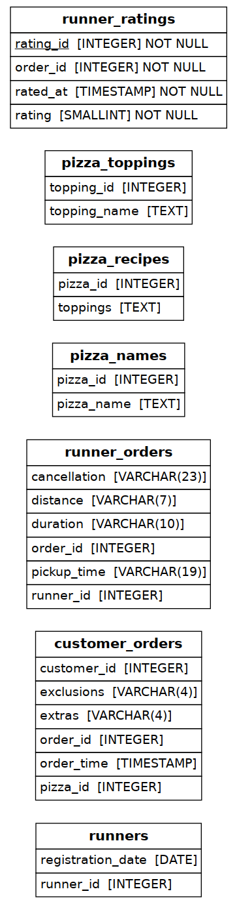

# Pizza Runner — Data Cleaning & Delivery Logistics Analytics

A PostgreSQL project built around Danny Ma's [Pizza Runner case study](https://8weeksqlchallenge.com/case-study-2/)
(8 Week SQL Challenge). This project deliberately keeps Danny's **original, intentionally messy
dataset** unmodified, because the messiness is the point: most of the value here is in the
data-cleaning layer, not just the final queries.

## 1. Why Keep the Messy Data?

A common mistake when doing this case study for a portfolio is to "fix" the data before loading it,
which quietly deletes the actual skill being tested. Real operational data — orders, delivery logs,
POS exports — is full of exactly this kind of mess: a mix of `NULL` and `''` meaning the same thing,
units inconsistently appended to numbers (`20km` vs `23.4 km` vs `23.4`), and literal text `"null"`
or `"NaN"` instead of a real null. This project keeps all of that in the raw tables and treats
**cleaning it correctly, with the fixes documented and isolated**, as the actual deliverable.

## 2. Schema



The raw schema (`01_schema.sql`) intentionally has **loose typing and no foreign keys** between
tables — this matches the original case study exactly, where `customer_orders`, `runner_orders`,
etc. are joined only by convention on `order_id` / `pizza_id` / `topping_id`, not by declared
constraints. This is a realistic starting point for a "data export with no schema enforcement"
scenario, and it's why a cleaning layer is necessary before any reliable analysis can happen.

| Table | Raw Issue |
|---|---|
| `customer_orders` | `exclusions` / `extras` mix `NULL` and `''` for "no change"; values are comma-separated topping ID strings, not arrays |
| `runner_orders` | `distance` mixes `'20km'`, `'13.4km'`, `'23.4'`, `'23.4 km'`; `duration` mixes `'32 minutes'`, `'20 mins'`, `'25mins'`; `pickup_time` and `cancellation` use the literal text `'null'` instead of real `NULL` |
| `runner_orders` | **Known data issue** (flagged by the case study itself): orders 7, 8, and 10 have a `pickup_time` dated in **2020**, a year before their `order_time` in 2021 |

## 3. The Cleaning Layer (`03_clean_data.sql`)

Rather than mutating the raw tables, this project builds clean **views** on top of them
(`customer_orders_clean`, `runner_orders_clean`, `successful_deliveries`). This keeps the
"before" state always inspectable and the fixes auditable in one place:

- `exclusions` / `extras` → normalized to `NULL` or a proper `INTEGER[]` array
- `distance` → `NUMERIC` (stripped of all non-numeric characters)
- `duration` → `INTEGER` minutes (stripped of all non-digit characters)
- `pickup_time` / `cancellation` → literal `'null'` / `'NaN'` / `''` strings converted to real `NULL`
- **The 2020/2021 pickup date issue is corrected explicitly** — for orders 7, 8, and 10, one year
  is added back to `pickup_time` so it falls after `order_time`, since a pickup cannot logically
  precede the order being placed. This fix is isolated to three named order IDs in the view
  definition specifically so it's easy to spot, question, or revert — it is not a silent blanket
  correction.
- A synthetic `row_id` is added to `customer_orders_clean` (via `ROW_NUMBER()`), because the raw
  table has no unique key — a customer can order the exact same pizza twice in one order, producing
  fully identical rows. Several queries (e.g. the per-pizza ingredient breakdown) need to
  distinguish those rows individually.

## 4. Analysis (`04_analysis_queries.sql`)

All queries run against the cleaned views, organized into the same five sections as the original
case study:

- **Section A — Pizza Metrics:** order volume, pizza type breakdown, customizations, time-of-day/
  day-of-week ordering patterns
- **Section B — Runner & Customer Experience:** pickup times, prep-time-vs-order-size relationship,
  delivery speed, runner success rate
- **Section C — Ingredient Optimisation:** standard recipes, most common extras/exclusions, and a
  generated ingredient list per pizza (with a `2x` prefix for toppings added as both base and extra)
  — this is the hardest section, requiring `UNNEST`, set operations, and careful row-level grouping
- **Section D — Pricing & Ratings:** revenue calculations, a `runner_ratings` table design + sample
  data, a single combined reporting view joining customers/orders/runners/ratings, and net revenue
  after runner pay
- **Section E — Bonus:** demonstrates that adding a brand-new "Supreme" pizza (with all 12 toppings)
  requires zero schema changes — just two `INSERT`s — which is a direct payoff of normalizing
  toppings into their own recipe table instead of hardcoding pizza-specific logic.

## 5. Notable Findings

| Question | Finding |
|---|---|
| Does order size affect prep time? | Yes, clearly: ~12 min for 1 pizza, ~18 min for 2, ~29 min for 3 — a near-linear relationship. |
| Is runner delivery speed consistent? | No — runner 2's computed speed ranges from ~35 km/h to ~94 km/h across deliveries, which is unrealistic for normal driving and likely reflects noisy duration data rather than actual driving behavior. Worth flagging operationally, not silently averaging away. |
| What's the net revenue after paying runners? | $138 in pizza revenue, minus $43.56 in runner pay (at $0.30/km), leaves **$94.44**. |
| Most over-requested topping? | **Bacon** is the most common added extra; **Cheese** is the most common exclusion. |

## 6. How to Run

```bash
createdb pizza_runner_db
psql -d pizza_runner_db -f sql/01_schema.sql
psql -d pizza_runner_db -f sql/02_seed_data.sql
psql -d pizza_runner_db -f sql/03_clean_data.sql
psql -d pizza_runner_db -f sql/04_analysis_queries.sql
```

## 7. What This Project Demonstrates (beyond FlavorMetrics)

- **Data cleaning as a first-class step** — regex-based string parsing, type casting, and explicit
  handling of inconsistent null representations, kept separate from analysis logic
- Working with a schema that has **no enforced constraints**, and reasoning about what the correct
  constraint *would* be (e.g. the `runner_ratings` design decision in Section D)
- `UNNEST`, `STRING_TO_ARRAY`, and `LATERAL` joins for working with delimited list-like columns
- Recognizing and explicitly correcting a real, flagged data-quality issue (the 2020 pickup dates)
  rather than ignoring it or guessing silently
- Schema extensibility: showing *why* a normalized toppings/recipes design pays off when the menu
  changes

---

*This project is a direct, schema-faithful implementation of Danny Ma's Pizza Runner case study
from the [8 Week SQL Challenge](https://8weeksqlchallenge.com/case-study-2/), using his original
dataset unmodified. The cleaning layer, the explicit data-issue correction, and the analysis
organization are original work built on top of it.*
