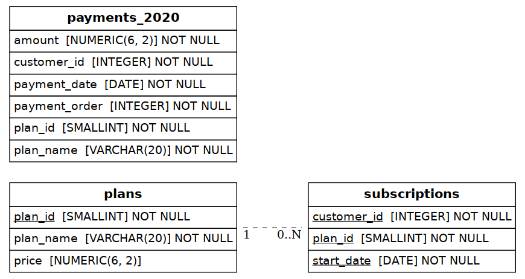

# Foodie-Fi — Subscription Analytics & Payment Modeling

A PostgreSQL project built around Danny Ma's [Foodie-Fi case study](https://8weeksqlchallenge.com/case-study-3/)
(8 Week SQL Challenge). Foodie-Fi is a fictional cooking-video subscription service; the case
study centers on modeling a subscription lifecycle (trial → plan changes → churn) from a
**change-log style table** rather than a flat one-row-per-billing-cycle table, and generating a
correct payment history from it.

## 1. Why a Synthetic Customer Base?

The case study's public page only publishes 8 sample customer journeys (the full ~1,000-customer
dataset is locked inside Danny's paid "Serious SQL" course). Several of the analysis questions —
monthly trial-signup distribution, churn rate, the 30-day-period breakdown of annual upgrades —
are close to meaningless on 8 rows; you need real volume for the answers to say anything.

So this project keeps the 8 published sample customers exactly as given (`02_seed_data_sample.sql`
— customer IDs 1–19, matching the case study precisely) and adds 250 synthetic customers
(`03_seed_data_synthetic.sql`, IDs 101+) generated to follow the **same plan-transition rules**:
trial → (basic / pro monthly / pro annual / churn), with realistic customer archetypes (loyal pro
subscribers, budget-conscious basic stayers, upgrade-then-churn, trial-only churners, etc.) so the
resulting distributions are realistic rather than just noise.

## 2. Schema



Just 2 core tables, exactly as the case study specifies:

| Table | Purpose |
|---|---|
| `plans` | The 5 possible plans: `trial` ($0), `basic monthly` ($9.90), `pro monthly` ($19.90), `pro annual` ($199), `churn` (`NULL` price) |
| `subscriptions` | One row per plan **change** for a customer — not one row per billing cycle. `start_date` is the date a customer's `plan_id` changed to that value. |

This is a genuinely different modeling challenge from a typical orders table: almost every
analysis question requires reasoning about *sequences* of rows per customer (what came before,
what came after, how many days between them) rather than simple aggregation.

## 3. Analysis (`04_analysis_queries.sql`)

**Section A — Customer Journey:** a SQL query (not hardcoded text) that generates a one-line
journey summary for each of the 8 published sample customers, e.g.
`trial on 2020-08-01 -> basic monthly on 2020-08-08`, with a written interpretation of each.

**Section B — Data Analysis (11 questions):** total customers, monthly trial-signup distribution,
post-2020 plan activity, churn rate, trial→churn rate, plan distribution immediately after trial,
plan distribution as of a fixed date, annual-upgrade counts and timing (including a 30-day-bucket
breakdown), and pro-monthly→basic downgrade counts. Built almost entirely with `ROW_NUMBER`,
`LAG`/`LEAD`, and self-joins against the same `subscriptions` table.

## 4. The Payments Challenge (`05_payments_challenge.sql`)

This is the hardest part of the case study: generate a full `payments_2020` table from the
subscriptions change-log, correctly handling:

- recurring monthly payments on the same day-of-month as the original `start_date`
- an upgrade (basic → pro monthly/annual, or pro monthly → annual) takes effect **immediately**,
  cutting off the previous billing cycle that same month
- an upgrade **from basic monthly** is discounted by that month's already-paid amount (e.g.
  $199 − $9.90 = $189.10)
- an upgrade **from pro monthly** to annual is charged the full $199 (no discount)
- a churned customer makes no further payments

The query was built and verified **row-for-row against every example in the case study's own
published output table** before being run across the full 258-customer base — all 7 published
example customers (1, 2, 13, 15, 16, 18, 19) match exactly, including the trickiest case
(customer 16's $189.10 discounted annual payment after a basic-monthly upgrade).

## 5. Section D — Open-Ended / Interview-Style Answers

The case study includes 5 open-ended "what would you do" questions with no single right answer.
Brief takes, grounded in what the data above actually shows:

1. **Rate of growth** — month-over-month new trial signups (Section B2) combined with
   trial→paid conversion rate (Section B6) gives a cleaner growth signal than raw signups alone,
   since signups can grow while conversion quietly degrades.
2. **Key metrics to track** — monthly churn rate, trial→paid conversion rate, average time-to-
   annual-upgrade (a proxy for engagement/commitment), and plan-mix over time (Section B7's
   snapshot, tracked monthly instead of once).
3. **Customer journeys worth digging into further** — specifically the basic→pro upgrade path
   (`budget_to_pro` in the synthetic data) — understanding what triggers that upsell is probably
   more actionable than studying churn alone.
4. **Exit survey questions** — what alternative they're switching to (or whether they're not
   switching), which features they actually used, whether price or content was the bigger factor,
   and whether they'd consider returning if X changed.
5. **Levers to reduce churn** — pricing experiments on the annual plan, proactive outreach timed
   just before predictable high-risk windows (e.g. right after the trial converts to paid, since
   Section B5/B6 show that's already a meaningful drop-off point), and content-engagement nudges.
   Worth flagging: in this dataset annual subscribers don't automatically churn less than monthly
   ones — some of the highest-value customers convert to annual and *still* churn later, which
   suggests annual commitment alone isn't a retention fix on its own. Validate any intervention via
   holdout A/B tests on churn rate, not pre/post comparisons alone.

## 6. How to Run

```bash
createdb foodie_fi_db
psql -d foodie_fi_db -f sql/01_schema.sql
psql -d foodie_fi_db -f sql/02_seed_data_sample.sql
psql -d foodie_fi_db -f sql/03_seed_data_synthetic.sql
psql -d foodie_fi_db -f sql/04_analysis_queries.sql
psql -d foodie_fi_db -f sql/05_payments_challenge.sql
```

## 7. What This Project Demonstrates

- Modeling and querying a **change-log / event-sourced table** (one row per state change, not
  per period) — a pattern that shows up constantly in subscription billing, CRM stage tracking,
  and status-history tables
- `LAG`/`LEAD` and `ROW_NUMBER` for sequence-aware analysis (what came before/after a given event)
- `generate_series` combined with `LATERAL` joins to expand a sparse change-log into a dense
  recurring-payment schedule — a non-trivial, genuinely useful SQL pattern
- Careful handling of business-rule edge cases (immediate vs. end-of-period effect, prorated
  discounts, churn cutoffs) verified against a known-correct published answer key
- Translating subscription data into the metrics and questions a product/growth team would
  actually ask

---

*This project implements Danny Ma's Foodie-Fi case study from the
[8 Week SQL Challenge](https://8weeksqlchallenge.com/case-study-3/). The 8 published sample
customers are reproduced exactly; the synthetic customer base, payment-generation logic, and
analysis are original work built to the same rules.*
